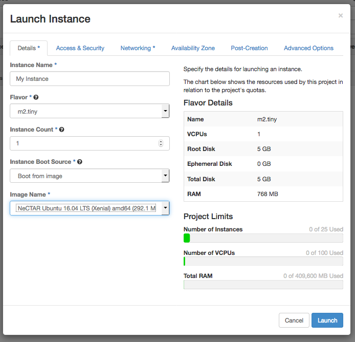

# Challenge 1: Create your first instance in the Melbourne Research Cloud

Today you'll bring online an instance running Linux (specifically, Ubuntu 16.04), and connect to it over SSH.

Let's go!

1. Login to https://dashboard.rc.nectar.org.au/ using your university account. If you haven't used Nectar before, you'll have to agree to the conditons and you'll be allocated a trial project, perfect for this demo.

2. First, navigate to 'Access & Security' (https://dashboard.rc.nectar.org.au/project/access_and_security/), go to the 'Key Pairs' tab, and click 'Create Key Pair'. Give it a name, and you'll then download the private half of the keypair (a file ending in .pem). Keep this file safe, anyone with access to it can control your instances.

3. Navigate to 'Instances' (https://dashboard.rc.nectar.org.au/project/instances/) and click 'Launch Instance'.

3. Enter the following options on the 'Detail' tab (the 'Image Name' will be under the 'Nectar Official').

    

4. Under the 'Access & Security' tab:

    * Make sure your new key pair is selected
    * Enable the 'default', 'http', and 'ssh' security groups.
    * If the 'http' and 'ssh' security groups aren't listed, you'll have to create them:
        * Navigate to 'Access & Security' again (https://dashboard.rc.nectar.org.au/project/access_and_security/), and click on the 'Security Groups' tab.
        * Click the 'Create Security Group', and name it 'ssh'.
        * Click on the 'Manage Rules' button of your new Security Group, and then 'Add Rule'.
        * Under the 'Rule' dropdown menu, select the 'SSH' option. Leave the other settings at their defaults, and click 'Add'.
        * Repeat the above to create a 'http' Security Group.
        
        
5. Click on 'Launch'. 

6. Your instance will now be created. It will take a couple minutes to come online, when it does you should see an IP address listed in your list of instances (https://dashboard.rc.nectar.org.au/project/instances/).

7. Open your SSH client, and connect to your instance using the IP address listed in the previous step. The username will be 'ubuntu', and instead of using a password, you should select the key you created in step 2. Setup of your SSH client was described in the pre-requisites, you can find the details [here](../prerequisites/ssh_client.md).

8. You're now connected to your instance! Try running a command; type the following into the command prompt and hit enter:
```echo hello world > hello.txt```

This will write `hello world!` to a textfile called `hello.txt`.

9. Yell out if you get stuck. Alternatively, if this was easy for you, lend a hand to those nearby!