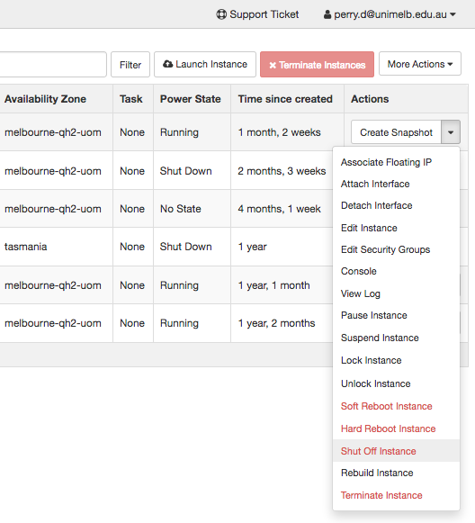

# Challenge 3: Clone your instance using a snapshot

You've got everything setup just the way you like on your instance, with all your favourite software and data. 

Someone else in your lab has seen it, and now they want one too! But don't worry, with snapshots, you can copy everything over rather than starting from scratch.

1. Back at the dashboard (https://dashboard.rc.nectar.org.au/), go to the menu on the right for the instance we created earlier, and select 'Shut Off Instance'. This is just like pushing the power button on a physical computer. Note all the other handy actions the are available. The main one to be cautious about is 'Terminate Instance', if you select that, your instance and everything on it will be deleted permanently! 

2. Once your instance shows 'Shutoff' in the 'Status' column, you can select 'Create Snapshot' from the actions menu. Give it whatever name you like. 

N.B. We should shut-off our instance before creating a snapshot, if at all possible. Imagine if your instance is midway through moving a file when we snapshot it, the resulting snapshot could be corrupt because it was midway through an operation.

3. The snapshot process will take a few minutes, and when it's complete it will be available in the 'Images' section of the dashboard (https://dashboard.rc.nectar.org.au/project/images/)

4. From the 'Images' section of the dashboard, select the 'Launch Instance' action. The 'Instance Boot Source' and 'Instance Snapshot' fields will be filled automatically, but otherwise set the flavor, keypair and security groups as per the first challenge, and the instance name to whatever you like.

5. Launch the instance 

