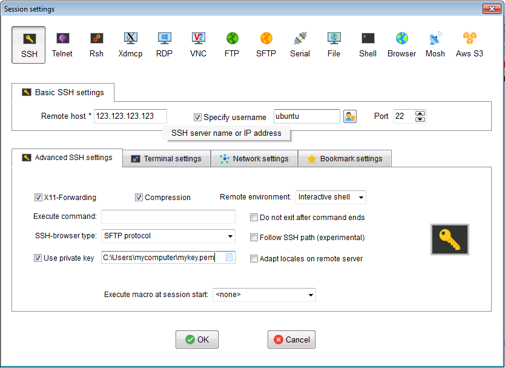

# Get an SSH Client Running

We'll be talking to our computer in the cloud using a protocol called SSH (Secure SHell). This lets us start a secure command-line session with a remote machine running Linux or a similar operating system. We SSH via a client on our own computer, but the exact setup varies depending on how this is setup. This can be a little fiddly the first time, so it's worth testing your SSH client beforehand.

### Windows
Unfortunately Windows doesn't include an SSH client, so you should install one before attending the training.

We suggest MobaXTerm which is available at http://mobaxterm.mobatek.net/download-home-edition.html

Download either:

* Portable edition, and just unzip it
* Installer edition (may require administrator privileges on your machine)

Create a new session. For example, to connect to a computer with IP address `123.123.123.123`, username `ubuntu`, with private key `mykem.pem`:
 
 


### Mac (OS X)
Luckily OS X already has an SSH client built-in, so there is nothing to install before the training.

To use the SSH client, open the terminal by going to Applications -> Utilities -> Terminal

To connect to the computer with IP address `123.123.123.123` and username `ubuntu`, we type:

```ssh ubuntu@123.123.123.123```

You will be prompted for a password, but we want to use our private key instead (which you can download from the research cloud dashboard).

For example, if you saved your key to your home directory as `mykey.pem`:

```ssh -i ~/mykey.pem ubuntu@123.123.123.123```
