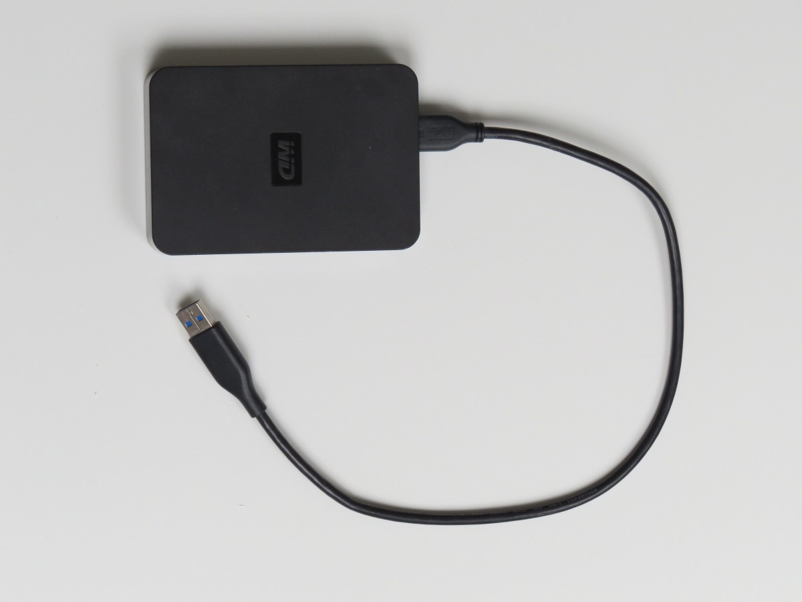

	
## Getting Started with the Melbourne Research Cloud

<i class="fa fa-cloud fa-5x fa-inverse" aria-hidden="true"></i>

Dr. David Perry

<small>perry.d@unimelb.edu.au  /  <i class="fa fa-twitter" aria-hidden="true"></i> @dwjperry</small>

---

Pre-Requisites

* Laptop
* Working SSH Client
* University Email Address
* Basic Linux Commands

Note: These were circulated prior to this class. If you don't have all of these, you'll miss out a little, but if you work with others you can probably get by.

---

Training Outcomes

* Understand what cloud computing is about
* Submit an allocation request
* Create and operate a computer in the cloud
* Understand cloud data storage
* Know where to go for help

Note: Here's an outline of what we're going to cover. We're going to keep things mostly conceptual, with a bit of hands on content. The reality is there is more to this than I can cover in one-day, and even if I could cover it, you'd probably forget the details once you need it!

---

PDF Slides: http://go.unimelb.edu.au/mm56

---

## Part 1: Background

---

### A boring cloud taxonomy:

<table>
	<thead>
		<tr>
			<td><strong>Infrastructure as a Service (IaaS)</strong></td><td><strong>Platform as a Service (PaaS)</strong></td><td><strong>Software as a Service (SaaS)</strong></td>
		</tr>
	</thead>
	<tr>
		<td>
			<li>Amazon Web Services</li>
			<li>Microsoft Azure</li>
			<li>Nectar</li>
		</td>
		<td>
			<li>Heroku</li>
			<li>Google App Engine</li>
		</td>
		<td>
			<li>Dropbox</li>
			<li>Google Docs</li>
		</td>
	</tr>
</table>

Note: You've probably heard of Dropbox, but what about Amazon Web Services (AWS)? They provide IaaS, which is what we mean  when we talk about 'cloud' in todays session. Some years back, Amazon figured they were good at running data centres, and should rent out spare capacity to others. Users could simply rent a computer for an hour at a time, rather than buy and maintain their own. Amazon actually make more money from AWS these days than retailing! IaaS is what we're talking about today.

---

No really, what is it?

---

*Computing on tap...*

---

<section>
    
    
</section>

Note: An analogy. A water bottle is portable, often convenient, but it has a limited size. Water on tap is abundant, practically unlimited. You pay per unit of usage, and usually much less than for bottled water.

---

<section>
    
    
</section>

Note: In this analogy, the 'reservoir' is the data centre. When you're using the research cloud, you're tapping into a reservoir of thousands of computers in the university data centre that are managed for you, and available on-demand.

---

Do these apply to you?

- I want a *faster* computer
- I want *lots* of computers
- I want a *special* kind of computer
- I want to *share* my computer with collaborators
- I want my computer to *host* a web service

---

...and you want them all right now.

Note: This is the important bit, you need a computer, but you don't want the trouble and delay of buying one.

---

Then maybe you need cloud computing!

---

Some (Brief) Case Studies

Note: This is a challenging course to give because the benefits of cloud computing are so abstract and the applications diverse. I can't possibly enumerate all the situations in which it might be useful, and I bet you'll come up with ideas I haven't. For the sake of something concrete, here are a couple real case studies of how the Melbourne Research Cloud is being used.

---

### Rendering Artwork

* Rendering animation works; takes too long on desktop computer!
* Run on a large computer in the cloud instead.

Note: Brendan Lee is doing a Masters of Fine Art, and his works are generated in a 3D rendering package called Carrera. This was getting slow! We helped him provision a powerful computer in the cloud, and install Windows and Carrera. The work was able to be completed more quickly, could be left running unattended, and freed up his computer for other work.

---

### Analyse Brain Function

* A desktop environment, with MRI analysis software pre-installed.
* Easy for new students to get started.

Note: Scott Kolbe and his group at the Florey use neuroimaging to study the brain. They do much of their work on cloud-based computers, using a customised environment with all the necessary specialist software pre-installed. As you might imagine, this software is fiddly to setup and so this saves a bunch of time, makes sure everyone can work consistently, and access powerful computation when needed (they also use HPC on occasion, which I'll talk about in a bit). Since they are using computers in the university data centre, this also means they can access their data stores much more quickly than if they had to go through their local network to upload/download.

---

### What about high-performance computing (HPC)?

i.e. Use a supercomputer!

Note: Another service we provide is HPC via our local cluster, called Spartan. HPC is suited to big analysis jobs, especially for software that can run in Linux. In the cloud you can get your own private resources, whereas in HPC you submit work to a shared system. That could be a good thing or a bad thing depending on your needs.

---

### High-Performance vs. Cloud Computing

Need complete control? Don't like sharing/waiting? Hosting a web service? Need Windows? ➡️ Cloud

Don't want to manage a system yourself? Need enormous scale? ➡️ HPC

Note: Here are some guidelines on which to choose. Some researchers use both. We run 1-day training on HPC if you're interested in finding out more, or visit our documentation page.

---

For more info, visit: http://dashboard.hpc.unimelb.edu.au

Note: If you'd like to know more, visit Spartan's homepage which includes details on getting started and training, or feel free to come chat to me.

---

### Virtual Laboratories

Domain-specific environments built upon the research cloud.

* Genomics Virtual Laboratory
* All-Sky Virtual Observatory
* Virtual Geophysics Lab
* ... and more: https://nectar.org.au/labs-and-tools/

Note: So, in the research cloud we're mostly creating our own environment from scratch. But several groups have built their own specialist platforms ontop, and perhaps there is one to suit you? These include pre-built software, datasets and an established user community.

---

## Part 1: Introduction to the Research Cloud

---

## Oh no, jargon!

* Instance
* Image
* Volume Storage
* Object Storage
* Security Groups
* Flavor
* Availability Zone
* Keypairs

Note: Unfortunately there is some jargon we have to get through. Let's work through these concepts one at a time, and see how they link together. I don't expect it will make sense right away; we'll sketch out these concepts and then work through some concrete examples with some repetition.

---

Instance

<i class="fa fa-desktop fa-5x" aria-hidden="true"></i>

Note: Describe each of these concepts, and put them altogether by drawing on whiteboard (todo: pre-design diagram, print icons to use on whiteboard)

---

Image

<i class="fa fa-file-photo-o fa-5x" aria-hidden="true"></i>

---

Volume Storage

<i class="fa fa-hdd-o fa-5x" aria-hidden="true"></i>

---

Object Storage

<i class="fa fa-th fa-5x" aria-hidden="true"></i>

---

Security Group

<i class="fa fa-filter fa-5x" aria-hidden="true"></i>

---

Flavor

<i class="fa fa-desktop fa-2x" aria-hidden="true"></i>  <i class="fa fa-desktop fa-3x" aria-hidden="true"></i>  <i class="fa fa-desktop fa-5x" aria-hidden="true"></i>

---

Availability Zone

<i class="fa fa-globe fa-5x" aria-hidden="true"></i>

---

Key Pair

<i class="fa fa-key fa-5x" aria-hidden="true"></i>  <i class="fa fa-unlock-alt fa-5x" aria-hidden="true"></i>

---

SSH (Secure SHell)

<i class="fa fa-terminal fa-5x" aria-hidden="true"></i>

---

Nectar

---

## Part 2: Create an Instance

---

Demo: Let's create an instance.

---

Recap:

* Trial project with 2 CPU-Months of compute time available immediately.
* Create an  __Instance__, with a particular __Flavor__.
* Use an __Image__ to load an operating system (and perhaps software) onto it.
* Select a __Keypair__ to use with the __Instance__, allowing us to login.
* Set some __Security Groups__ to allow network access in/out of the __Instance__.
* Choose an __Availability Zone__ (data centre) within the Nectar network where our __Instance__ will reside.
* We connect to our __Instance__ via __SSH__, which authenticates us using our __Keypair__.

---

### Your turn!

Challenge 1: Create an instance and connect to it.

Instructions: http://go.unimelb.edu.au/j7d6

Note: Now it's your turn to have a go! Work in groups; I suggest one person has the instructions open on their computer, while another drives the dashboard and SSH client through their computer.

---

Where to go for help?

<i class="fa fa-question fa-5x" aria-hidden="true"></i>

Note: So, I can't cover every aspect of the research cloud today, and even if I could, you wouldn't remember it all. Today is about getting the basic concepts down, but at some point you're going to need help, either from online resources, or from our support team. This is what distinguishes us from commercial cloud providers (other than being free!), we're here to support you and don't expect you to go it alone.

---

Self-Paced Training: http://training.nectar.org.au/

General Documentation: http://support.nectar.org.au/

Helpdesk: support@nectar.org.au.

Note: (To be updated when local Melbourne docs and queue online) We have a few options -- you can check out Nectar's self-paced training which goes over everything in detail, and just pick up sections you need. Or there is specific documentation. Failing that, you're very welcome to contact us via our helpdesk.

---

Note: In fact, you can contact the helpdesk right inside the dashboard by clicking here.

---

Note: ... you can access the documentation from here, or submit a ticket.

---

Challenge 2: Find out about Object Storage

* Use the training/documentation/Google to figure out:
    * How to upload a file to object storage from the dashboard?
    * How many copies of your data does the object store keep to ensure integrity?

Hint: http://training.nectar.org.au/package07/sections/objectStorage.html

Note: So I've described roughly what object storage is about, have a go at trying to upload a file from your computer to object storage, referring to whatever online documentation you can find. If you can't find what you need, that's perfectly okay, just let me know and I'll help.

---

Recap: Object Store

Note: Ask what resources people found. Did you figure it out, or was something missing? Show how to upload something to the dashboard, and go through the documentation, which outlines other options -- we can also upload files via GUI and command line tools.

---

## Part 3: Security

---

Note: Now a few words on security. Unlike your official university computer, which is locked down by central IT, we give you a lot of freedom on the research cloud. But with this comes some security hazards which you need to be aware of.

---

### Joint responsibility

* We protect the cloud backend
* But you are responsible for what runs on it

Note: We have joint responsibility; the research cloud has a team working on keeping the infrastructure operational and secure; but we don't control (or necessarily know) what you're running inside it. For example, if you run some very old blogging software with known vulnerabilities, it's possible your instances will be taken over, and we won't notice until someone else on the web makes a complaint. This doesn't happen often (perhaps once a month), but does occur. The hackers aren't out to get you exactly, there are some just bad actors that scan the internet for every single machine that exhibits a particular known vulnerability.

---

## Basic Security Principles

Note: It's not possible to eliminate all security risks, but there are some simple steps you can take which don't require a bunch of specialist know-how.

---

### Minimise Means of Access

* Only allow access from necessary ports/addresses.
* Power off or terminate resources you don't need.
* Don't run services you don't need.

Note: The first step is to provide only the bare minimum means of access to do your work. Ideally, power off or suspend your machine when you're not using it (can't hack a machine that's turned off!) Don't add security groups you don't need (ideally just stick to SSH, and keep your private key safe), and if possible lock down access to particular IP address ranges. For example, you could limit access to addresses used by the University virtual private network (VPN; staff: 10.1.128.0/22, student: 10.9.128.0/22). In reality though, you might to run a web server or similar, in which case you have to take a more active role.

---

### Keep OS and Software Up-To-Date

Subscribe to relevant updates/advisorsies for your software and operating system.

Note: If you're running something like a web app, database or other service that's possible for others to access, you have to be a bit more diligent. This includes keeping both your operating system (OS) up to date, as well as the software running on it. Over time security flaws are discovered in various packages, and if you hold onto an old version for too long, it's possible it could be compromised.

---

Note: Here's an example of the sort of thing I'm talking about. Wordpress is a really popular blogging platform, and the sort of software you might like to host yourself on the research cloud. Much sure you subscribe to their newsletter or similar so you can be kept up to date about new versions. Some of these will be about fixing bugs or adding features, but others will be around fixing security flaws that have been discovered.

---

### Sensitive Data?

* Be aware of ethics, funding and institution requirements.
* Encrypt sensitive data, and secure the decryption key/password.

Note: Let's say your instance has been compromised somehow, even after being very careful. Unfortunately it still happens despite best intentions, for example through social engineering, physical theft or human error. How can you limit the resulting damage? If you're working with potentially sensitive data, it's worth considering an extra layer of protection, including encrypting files.

---

### Backup

Things can still go wrong ☹️

Note: Say there has been a security issue, hardware failure, or you have just goofed somehow, and you need to recover. The Research Cloud makes it easy to create backups so you can do so.

---

## Part 4: Snapshots

---

Introducing Snapshots

* Like an image, but copied from an existing instance.
* Includes: Everything - OS, Software, Data
* Use for backup, duplicating instances, and more!

Note: You can make a copy of your instance, including the OS, your data, and any software you've installed, and this is called a snapshot. You can then use that snapshot to create a new instance with the exact same setup. This can be used to roll back to an earlier setup, or clone an existing one (i.e. have multiple identical instances).

---

Don't forget the object store

Automatically keeps three copies of your data ➡️ Free backup!

Note: Data in the object store is quite safe, as at least three copies are kept at any one time, including a copy off-site. So if you can, it's really handy to keep your data there, and you can access it from your desktop, instances, anywhere really. Keep in mind though that it won't protect against human error, i.e. accidental deletion!

---

Challenge 3: Clone your instance using a snapshot

Instructions: http://go.unimelb.edu.au/43v6

---

## Part 5: Storage

---

### Volume Storage

<i class="fa fa-hdd-o fa-5x" aria-hidden="true"></i>

---

---

Demo: Create a volume, connect it to instance, format it, and write to it.

Note: So, I'll show you how to create a volume and attach it to your instance. Unfortunately we can't do this together as trial projects don't include any volume storage quota :-(

---

<pre><code class="bash">sudo mkfs.ext4 /dev/vdc # Format the volume
sudo mkdir /my_volume # Create a mount point
sudo mount /dev/vdc /my_volume -t auto # Mount the volume
sudo chown ubuntu /volume_name # Make sure our ubuntu user can access it
sudo du -sh /my_volume # Show how much of the volume is used</code></pre>

Note: I'll create the volume and attach it to my instance in the dashboard, and then on my instance I'll run these commands so I can actually use it.

---

### Catch all of that?

Don't worry, instructions for doing this at:
https://support.ehelp.edu.au/support/solutions/articles/6000055382-introduction-to-cloud-storage

Note: I know that's a bit to take in, but don't worry, you can refer to the documentation as needed (I certainly don't remember all of this of the top of my head!)

---

### Ephemeral Storage

* Special type of storage included with some instance flavours.
* Not included in snapshots, and lost on reboot.
* Handy for 'scratch space': Temporary storage for files you don't need to keep.

Note: Another type of storage I'll mention is ephermal storage -- you might notice this is available for some of the larger flavours. Say you need to save some intermediate results while you're doing some data analysis, but don't need to keep them -- ephemeral storage is ideal for this. Just take care that you don't storage anything crucial there, everything will disappear when you reboot your instance!

---

### Object Storage

<i class="fa fa-th fa-5x" aria-hidden="true"></i>

* Files, stored in 'containers'
* Can organise into (pseudo) folders
* Can keep container private, or make public (readable by everyone)
* Resilient: At least 3 copies of everything retained.

---

<section>
	<table>
    	<thead><tr>
            <th></th>
            <th>Volume</th>
			<th>Ephemeral</th>
            <th>Object</th>
        </tr></thead>
        <tbody>
		<tr>
            <td><strong>Access</strong></td>
            <td>From attached instance</td>
			<td>From attached instance</td>
            <td>Anywhere</td>
        </tr>
        <tr>
            <td><strong>Resilience</strong></td>
            <td>Low</td>
			<td>Low</td>
            <td>High</td>
        </tr>
		<tr>
            <td><strong>Transferring Files</strong></td>
            <td>Like any other folder on your computer.</td>
			<td>Like any other folder on your computer.</td>
            <td>Web interface, or command line or GUI client</td>
        </tr>
		<tr>
            <td><strong>Persistent</strong></td>
            <td>Yes</td>
			<td>No</td>
            <td>Yes</td>
        </tr>
		</tbody>
    </table>
</section>

Note: So here's a comparison of all the storage options at once. Volume storage is just like a USB HDD. Ephemeral storage is similar, but gets wiped after a reboot so is just for temporary files. Object storage is more abstract, maybe a little like Dropbox. You can upload/download files from anywhere, using a GUI, web or command line client, and it is inherently resilient (i.e. resistent data corruption due to hard drive crashes, etc.).

---

### Need managed data services?

Visit: https://research.unimelb.edu.au/infrastructure/research-platform-services/services/data-storage-management

Note: I've talked about quite low-level storage infrastructure, which you can use to build more complex systems like databases yourself. But our department (ResPlat) also offers some more specialised managed services, such as systems for managing instrument data. Get in touch and we can help you decide if they might work for you.

---

## Part 6: Resource Allocations

---

Automatic trial allocation: ~2 small instances for 2 months.

---

### Requesting More Resources

---

---

## Part 7: Wrapping Up

Note: We're getting near the end, just a few little items to wrap up.

---

## Terminating Instances

Note: So, when we are done with an instance, we can terminate it. Note that this will destroy everything on the instance, permanently. However, any snapshots will be preserved, as will anything stored in a separate storage volume.

---

Final Challenge: Terminate your instance!

Note: Go ahead and terminate the instance(s) you created in the first challenge. You'll lose your work, but you can always re-build from scratch, or using the snapshot you created. Once this is done, you'll no longer be consuming your trial quota, saving it for more useful things.

---

## Special Bonus Topics

---

### Windows Instances

Possible, but a bit complicated for now.

See: https://github.com/resbaz/HOWTO-Nectar-Windows-VM

---

### Software Licensing

* You can BYO license
* Or use a University site license, provided you select a Melbourne availability zone.

Note: You might be wondering about commercial software. Well, just about anything you can run on your own computer will work in the cloud too, and most software licenses allow for that. You're welcome to bring your own license for a piece of software if you already have it, or the University has an extensive range of licensed software already available, including things like MATLAB, and almost every Microsoft product. Keep in mind is that University-licensed software generally has to run on University hardware, in which case you must select a Melbourne Availability Zone for your instance.

---

### GPU Instances

NVIDA M10 GPUs available for Graphics Work

e.g. CAD, neuroimaging

Contact us, or checkout this for more: https://github.com/resbaz/HOWTO-Nectar-GPU

---

Need general-purpose GPU resources (e.g. for deep learning)?

Try our HPC cluster Spartan: https://dashboard.hpc.unimelb.edu.au/gpu/

---

### Linux Desktop Access

---

To get started with a Linux desktop: http://training.nectar.org.au/package07/sections/connectWithX2Go.html

---

## The End

Questions?

PDF Slides: http://go.unimelb.edu.au/mm56

---
